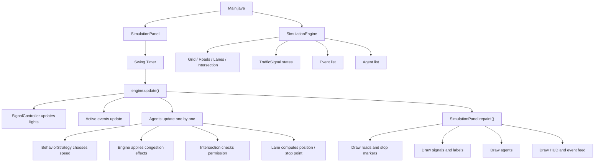
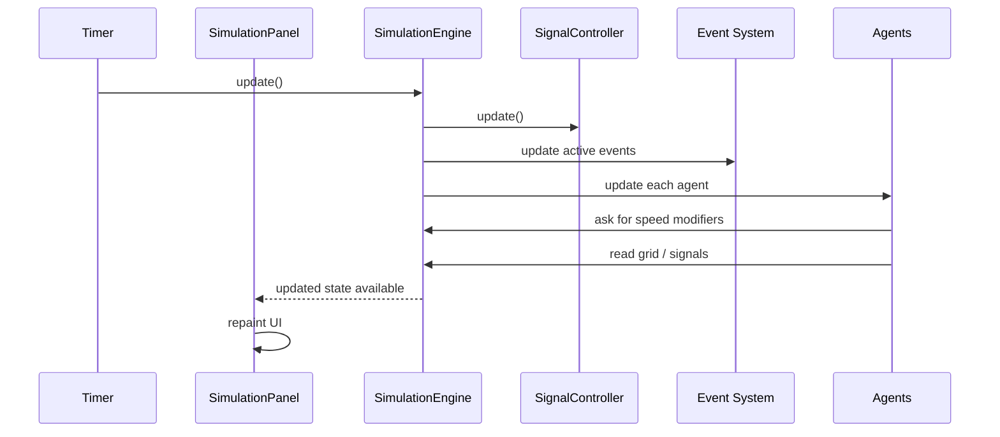

# Traffic Simulation

A Java Swing traffic simulation that models:

- Traffic signals with `RED`, `GREEN`, and `YELLOW` states
- Lane-based movement for cars and pedestrians
- Pedestrian crossing rules based on conflicting vehicle signals
- Behavior strategies for normal and aggressive agents
- Random accident and congestion events
- A live UI with road labels, stop markers, signal summaries, and event status

## Project Structure

```text
traffic-simulation/
|-- src/
|   `-- main/
|       |-- Main.java
|       |-- agents/
|       |-- behavior/
|       |-- engine/
|       |-- environment/
|       |-- events/
|       |-- traffic/
|       `-- ui/
|-- bin/
|-- CODE_WALKTHROUGH.md
`-- README.md
```

## Compile

PowerShell:

```powershell
New-Item -ItemType Directory -Force bin | Out-Null
$files = Get-ChildItem -Path src/main -Recurse -Filter *.java | ForEach-Object { $_.FullName }
javac -d bin $files
```

## Run

```powershell
java -cp bin Main
```

## Notes

- Cars remain constrained to their assigned lanes.
- Signals alternate the right-of-way at the central intersection.
- Pedestrians stay on the crosswalk lanes and only proceed when the conflicting vehicle direction is red.
- Accident events block an entire lane for a limited duration.
- Congestion events create slowdown zones that reduce agent speed.
- The UI shows road names, direction hints, colored stop markers, signal summaries, and active events so the simulation is easier to read.
- The current grid is intentionally compact so the architecture stays easy to extend.

## Current UI Guide

- `Main Street` is the horizontal road for cars.
- `Central Avenue` is the vertical road for cars.
- `Crosswalk` is the pedestrian path through the junction.
- Colored stop markers near the junction show which vehicle approach must stop or may proceed.
- The top-left card summarizes which road currently has the right-of-way.
- The right-side dashboard shows metrics, signal status, legend items, and active events.

## Architecture

### High-Level Components

- `Main.java`: starts the application window and loads the simulation panel.
- `SimulationEngine`: central coordinator that updates time, signals, events, and agents.
- `Grid`, `Road`, `Lane`, `Intersection`: define the simulation world and movement paths.
- `TrafficSignal`, `SignalController`: manage signal states and phase changes.
- `Agent`, `Car`, `Pedestrian`: represent moving actors in the system.
- `BehaviorStrategy`, `NormalBehavior`, `AggressiveBehavior`: define movement style and yellow-light behavior.
- `Event`, `AccidentEvent`, `CongestionEvent`: model temporary disruptions.
- `SimulationPanel`: renders the map, status cards, signals, legend, and active events.

### Flow Chart



### Request/Update Flow



## Methodology

### 1. Object-Oriented Design

This project is built using object-oriented modeling. Each real-world concept in traffic control is mapped to a class:

- roads and lanes model the environment
- cars and pedestrians model moving entities
- traffic lights model control logic
- events model disruptions such as accidents and congestion

This keeps responsibilities separated and makes the project easier to extend.

### 2. Discrete-Time Simulation

The simulation runs in repeated steps called ticks.

For each tick:

1. signal states are updated
2. active events are updated
3. agents evaluate movement rules
4. the UI redraws the new state

This is a simple and reliable approach for traffic-style simulations because all entities react to the same shared time step.

### 3. Lane-Constrained Movement

Agents do not move freely in open space. Instead, each agent belongs to a lane and stores its progress along that lane. This prevents chaotic movement and makes the logic easier to reason about.

### 4. Strategy Pattern For Behavior

Agent behavior is not hardcoded into one class. Instead, the project uses the Strategy pattern:

- `NormalBehavior`: follows safe movement rules
- `AggressiveBehavior`: moves faster and may proceed on yellow

This makes behavior extensible without rewriting agent movement logic.

### 5. Event-Driven Disruptions

Temporary traffic problems are modeled as event objects:

- `AccidentEvent` blocks a lane
- `CongestionEvent` slows movement in an area

Each event has its own lifecycle:

- apply
- remain active for some ticks
- clear itself when expired

### 6. Separation Of Logic And UI

The simulation logic and rendering logic are intentionally separate:

- `SimulationEngine` decides what happens
- `SimulationPanel` decides how it looks

This separation keeps the project cleaner and makes debugging easier.

### 7. Incremental Improvement Approach

The project was refined in stages:

- initial simulation loop and class structure
- corrected intersection detection and stop-line logic
- improved vehicle signal obedience
- added pedestrian crossing rules
- redesigned UI for readability and less clutter

This methodology helps keep the code testable and easier to evolve without rewriting the whole system.
